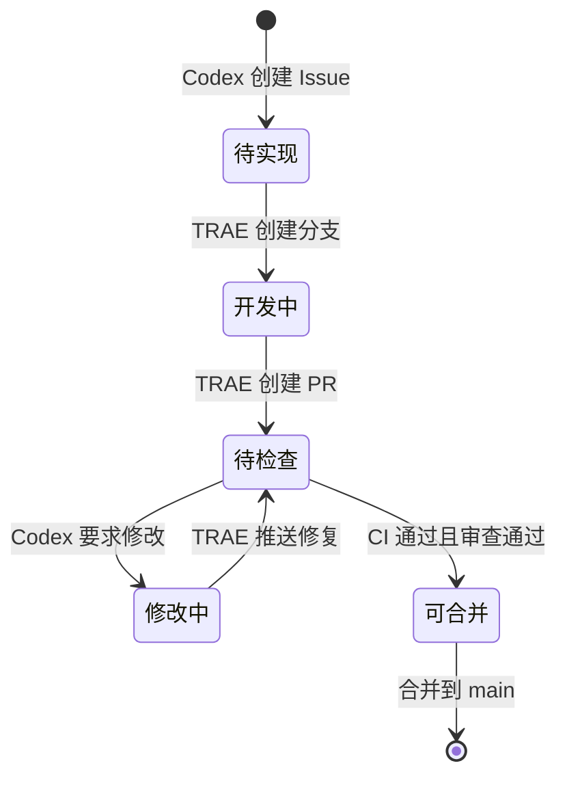

# Codex × TRAE GitHub 接力说明

## 目标

GitHub 是 Codex 与 TRAE 的共享任务箱和交付箱：

- Issue 保存 Codex 编写的任务说明。
- 分支保存 TRAE 的实现过程。
- Pull Request 保存 TRAE 完成报告、CI 结果和 Codex 审查意见。
- `main` 只保存已经通过检查的结果。

这样无需在 Codex 与 TRAE 之间来回复制整份说明书和完成报告。

## 状态流转



## 每个任务的操作

### Codex

1. 使用“AI 开发任务”Issue 表单。
2. 把任务写成独立、完整、可验收的说明。
3. 任务必须包含范围、非范围、验收标准与验证命令。
4. TRAE 提交 PR 后检查代码差异、CI、完成报告及安全风险。
5. 需要修改时直接写在 PR Review，不再让用户转述。

### TRAE

1. 打开 Issue，读取任务和 `AGENTS.md`。
2. 更新本地 `main`，创建 `trae/<issue-number>-<short-name>`。
3. 实现、验证、提交并推送。
4. 创建 PR，模板内容即完成报告。
5. 在同一个 PR 中处理 Codex 的审查意见。

## TRAE 一次性项目规则

在 TRAE 的项目规则中保存以下内容一次，后续无需重复粘贴长说明：

```text
你在 ESG-project 中担任实现代理。每次开发前先阅读根目录 AGENTS.md，并以指定的 GitHub Issue 作为唯一需求来源。

必须从最新 main 创建 trae/<issue-number>-<short-name> 分支；不得直接修改或推送 main。只实现 Issue 的明确范围，执行 Issue 和 AGENTS.md 规定的验证。完成后推送分支并创建 Pull Request，完整填写仓库 PR 模板，PR 正文就是完成报告。收到 Codex Review 后在同一分支修复，直到 CI 通过且无阻塞意见。

不得提交密码、Token、API Key、.env、真实用户数据、server/storage/uploads、缓存、构建产物或依赖目录。遇到敏感信息、破坏性数据操作、需求冲突或无法验证时立即停止并说明。
```

TRAE 官方支持在设置中心创建项目规则；建议把以上规则保存为本项目专用规则，而不是全局规则。

## Codex Review

有两种触发方式：

1. 推荐：在 Codex 的 GitHub Code Review 设置中为本仓库开启 Automatic reviews。
2. 备用：在 PR 评论中发送精确指令 `@codex review`。

自动评审开启后，TRAE 每次创建或更新 PR，Codex 会根据仓库 `AGENTS.md` 和 PR 差异执行审查。

## 当前自动化边界

GitHub 可以自动完成 CI、共享任务、传递报告和触发 Codex Review。TRAE 桌面端是否能在新 Issue 出现时自行启动，取决于 TRAE 是否提供可调用的守护进程、CLI 或外部触发接口。当前配置不模拟点击桌面软件，也不在仓库中保存任何个人令牌。

在没有外部触发接口时，日常操作已经缩短为：

1. 用户让 Codex 创建任务 Issue。
2. 用户在 TRAE 中只需说“执行 Issue #编号”。
3. 后续完成报告、CI、审查与修改全部在 GitHub PR 中流转。
