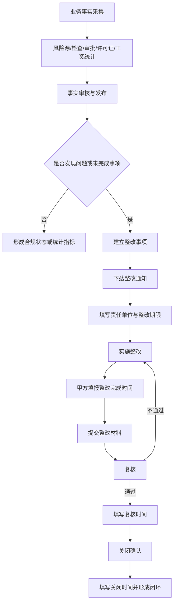

# ESG Demo V0.4 业务调整与数据模型设计方案

**版本：** V1.0（设计稿）  
**基线：** ESG Demo V0.3：首页一级指标业务事实校正版  
**状态：** 待业务确认；本阶段只输出设计，不实施

> 本文是 V0.4 的业务模型、数据模型和接口影响设计。未创建数据库表，未修改 SQL、API、前端或首页展示。

## 一、设计边界与核心原则

### 1. 本阶段范围

- 分析 V0.3 到 V0.4 的指标和业务结构变化。
- 设计业务事实表、检查表、整改闭环表和上传模板字段。
- 明确整改事项的状态流转、时间字段和数据责任。
- 评估未来 API 和前端的影响，不执行接口或页面调整。

### 2. 核心原则

1. **业务事实与整改闭环分离。** 风险源、审批事项、许可证、工资支付和检查记录是事实；整改通知、责任、期限、完成、复核和关闭是闭环过程。
2. **整改完成时间必须由甲方填报。** 字段 `rectification_completed_date` 的来源为甲方填报，系统不得自动推算、补写或用当前日期代替。
3. **所有整改事项保留完整时间链。** 至少包括发现时间、整改期限、整改完成时间、复核时间和关闭时间。
4. **风险等级沿用项目已有等级。** 本方案不新增等级，不自行定义枚举；优先使用“一般、重大、超危大”或设计文件中的现行等级。
5. **不采集不必要的个人敏感明细。** S03 只保留统计周期、人数和按时发放率，不采集个人姓名和工资金额明细。
6. **事实来源必须可追溯。** 每张业务事实表和闭环表应保留来源类型、来源文件或填报批次等追溯信息。

## 二、V0.3 → V0.4 变化说明

| 模块 | V0.3 基线 | V0.4 设计调整 | 设计影响 |
|---|---|---|---|
| S03 | 工资支付达标率，首页 100% | 农民工工资按时发放率，展示“工资按时发放率 100%” | 业务事实改为周期性支付统计；保留百分比表达 |
| G01/G02 | 审批合规率、许可管控完成率分开 | 合并为“合规审批与施工管控” | 审批、许可证、施工管控和专项方案形成统一合规过程 |
| 风险与方案 | S 组管理风险事实 | G 组管理风险审批过程 | 风险对象与专项方案审批通过 `risk_point_id` 关联 |
| G04 | 内控合规状态 | 内控检查与整改闭环 | 由状态型指标转为检查事实、整改过程和连续合规天数模型 |
| 整改数据 | 各模块可能各自记录 | 统一整改字段和状态流转 | E02、E03、G03、安全隐患等后续复用 |
| 首页 | V0.3 首页一级指标已冻结 | V0.4 仅提出模型和影响分析 | 本阶段不改首页，不改变 V0.3 运行结果 |

### 指标结构建议

E 组本阶段保持 E01-E04 不变。S 组保持 S01、S02、S04，调整 S03 的名称和业务来源。G 组建议形成三个业务主题：

1. 合规审批与施工管控（由原 G01+G02 合并）。
2. 设计变更受控（原 G03，名称可保持）。
3. 内控检查与整改闭环（由原 G04 调整）。

代码级 KPI key、首页卡片数量、合并后的分母和 API 兼容方式不在本设计稿中直接冻结，须在业务确认后单独形成接口变更单。

## 三、V0.4 业务流程总览



### 时间字段责任

| 字段 | 含义 | 主要责任 | 系统规则 |
|---|---|---|---|
| `discovered_date` | 问题/风险发现日期 | 检查或业务填报人员 | 必填，不能晚于整改期限的业务逻辑需校验 |
| `rectification_deadline` | 整改期限 | 甲方/责任单位确认 | 必填；可用于逾期判断 |
| `rectification_completed_date` | 实际整改完成日期 | 甲方填报 | 必填条件由状态控制；严禁系统自动生成 |
| `verification_date` | 复核日期 | 复核人员 | 进入“已完成”前必填 |
| `closed_date` | 正式关闭日期 | 关闭确认人员 | 进入“已关闭”前必填 |

## 四、S03 农民工工资保障设计

### 1. 指标定义

- **指标名称：** 农民工工资按时发放率。
- **首页表达：** 工资按时发放率 100%。
- **统计对象：** 统计周期内应发工资的农民工人数或项目确认的统计口径。
- **数据来源：** 财务系统接口或甲方人工填报结果。
- **禁止采集：** 个人姓名、身份证号、银行卡号、工资金额明细等不必要个人明细。

### 2. 业务事实表设计：`biz_labor_payment_record`

| 字段 | 类型建议 | 说明 | 必填 |
|---|---|---|---|
| `id` | bigint | 主键 | 是 |
| `project_id` | bigint | 项目标识 | 是 |
| `period` | date/string | 统计周期，如月份 | 是 |
| `total_workers` | int | 本周期统计人数 | 是 |
| `paid_on_time_rate` | decimal | 按时发放率，百分比数值 | 是 |
| `source_type` | varchar | 财务系统/人工填报 | 是 |
| `record_date` | date | 填报日期 | 是 |
| `created_time` | datetime | 创建时间 | 是 |

建议补充 `source_doc_ref`、`data_status` 和 `updated_time` 以支持追溯和更正，但是否新增由数据库评审确认。

## 五、G 组合规审批与施工管控设计

### 1. 业务边界

合并指标不是把事项简单相加，而是对以下过程进行统一合规判断：

- 项目审批事项；
- 行政许可和施工许可证；
- 施工管控要求；
- 重大风险对应的专项方案审批。

建议计算口径为：满足业务规则且已完成审批/管控的事项数 ÷ 纳入本周期管理的事项总数。分母必须来自事实表，不得由前端写死。

### 2. 审批事实表：`biz_project_approval`

该表在 V0.4 设计中保留，增加或确认以下字段：

| 字段 | 说明 |
|---|---|
| `approval_type` | 审批类型，如报批报建、专项方案等 |
| `approval_status` | 审批状态，沿用项目现有状态字典 |
| `approval_date` | 审批完成或批复日期 |
| `project_id` | 项目标识 |
| `source_doc_ref` | 来源文件或系统记录引用 |

原有字段和既有业务事实不得删除。字段的最终类型、状态字典和唯一约束另行评审。

### 3. 许可事实表：`biz_permit`

该表保留，用于记录许可证类型、许可状态、有效期、关联施工范围和来源资料。许可证是事实，不直接等同于整改事项；只有出现缺失、过期或管控不满足时，才建立对应整改闭环。

## 六、重大风险源与专项方案融合

### 1. S 组风险事实：`biz_safety_risk_point`

S 组负责记录风险事实，至少覆盖：

| 领域 | 设计字段 |
|---|---|
| 对象 | 风险对象名称/编码 |
| 等级 | 项目已有风险等级，不新增枚举 |
| 位置 | 标段、工点、桩号或 GIS 关联 |
| 状态 | 当前状态，沿用项目现有字典 |
| 追溯 | 来源文件、发现日期、责任单位 |

### 2. G 组专项方案审批表：`biz_special_plan_approval`

| 字段 | 说明 | 约束 |
|---|---|---|
| `id` | 主键 | 必填 |
| `project_id` | 项目标识 | 必填 |
| `risk_point_id` | 关联风险源 | 必填；关联 `biz_safety_risk_point` |
| `plan_name` | 专项方案名称 | 必填 |
| `risk_level` | 风险等级 | 沿用项目已有等级 |
| `approval_status` | 审批状态 | 沿用项目状态字典 |
| `approval_date` | 审批日期 | 审批完成时必填 |
| `approval_file` | 审批资料引用 | 记录文件引用，不在本表保存不受控大文件 |
| `remark` | 备注 | 可选 |
| `created_time` | 创建时间 | 必填 |

该表描述专项方案审批过程，不替代风险源事实表，也不直接承载整改过程。

## 七、G04 内控检查与整改闭环设计

### 1. 指标调整

- **原指标：** 内控合规状态。
- **建议指标：** 内控检查与整改闭环。
- **一级展示建议：** 连续内控合规天数。
- **任务书口径：** 项目开工日期至当前日期。

“是否因未关闭问题而重置连续天数”尚需业务确认。若不重置，指标就是日期差；若重置，必须定义重置事件和责任人，系统不得自行推断。

### 2. 检查事实表：`biz_governance_inspection`

| 字段 | 类型建议 | 说明 |
|---|---|---|
| `id` | bigint | 主键 |
| `project_id` | bigint | 项目标识 |
| `inspection_type` | varchar | 检查类型 |
| `inspection_source` | varchar | 上级检查、内部检查、审计、纪检 |
| `inspection_date` | date | 检查日期 |
| `inspection_unit` | varchar | 检查单位 |
| `problem_count` | int | 发现问题数量 |
| `source_doc_ref` | varchar | 检查记录或文件引用 |
| `created_time` | datetime | 创建时间 |

检查事实表只记录检查发生及发现情况，不直接保存每条整改的当前状态。

### 3. 整改事项表：`biz_governance_rectification`

| 字段 | 类型建议 | 说明 |
|---|---|---|
| `id` | bigint | 主键 |
| `project_id` | bigint | 项目标识 |
| `inspection_id` | bigint | 关联检查事实 |
| `problem_code` | varchar | 问题编号 |
| `problem_description` | text | 问题描述 |
| `rectification_requirement` | text | 整改要求 |
| `responsible_unit` | varchar | 责任单位 |
| `discovered_date` | date | 发现日期 |
| `rectification_deadline` | date | 整改期限 |
| `rectification_completed_date` | date | 甲方填报的实际完成日期，禁止自动生成 |
| `verification_date` | date | 复核日期 |
| `closed_date` | date | 正式关闭日期 |
| `status` | varchar | 当前状态 |
| `source_doc_ref` | varchar | 通知单、整改材料、复核资料引用 |
| `created_time` / `updated_time` | datetime | 记录维护时间 |

### 4. 状态机

```text
待整改 → 整改中 → 待复核 → 已完成 → 已关闭
                         ↓
                    复核不通过
                         ↓
                       整改中
```

状态规则：

- `待整改`：已发现或已下达整改要求，但尚未开始整改。
- `整改中`：责任单位正在实施整改，允许补充整改材料。
- `待复核`：已填报 `rectification_completed_date` 并提交复核。
- `已完成`：复核通过，`verification_date` 已填写。
- `已关闭`：完成正式关闭确认，`closed_date` 已填写。
- 复核不通过时回到 `整改中`，历史状态和退回原因必须保留。

`rectification_completed_date` 是状态进入“待复核”的关键人工字段；它不能由状态切换时间、上传时间或系统当前日期自动填充。

## 八、统一整改模板字段

所有涉及整改的上传模板统一增加或对齐以下字段：

| 模板字段 | 对应数据字段 | 填写责任 |
|---|---|---|
| 问题编号 | `problem_code` | 甲方/检查人员 |
| 问题描述 | `problem_description` | 检查人员 |
| 整改要求 | `rectification_requirement` | 检查人员/甲方 |
| 责任单位 | `responsible_unit` | 甲方确认 |
| 发现时间 | `discovered_date` | 检查人员 |
| 整改期限 | `rectification_deadline` | 甲方确认 |
| 整改完成时间 | `rectification_completed_date` | **甲方填报** |
| 复核时间 | `verification_date` | 复核人员 |
| 关闭时间 | `closed_date` | 关闭确认人员 |
| 当前状态 | `status` | 按流程维护 |

其中，**整改完成时间必须由甲方填报，系统不得自动推算。** 模板导入时如果该字段为空，系统只能保留为空并阻止进入“待复核”，不得用导入时间或当前日期代替。

## 九、其他整改业务复用

后续 E02 环保问题、E03 水保问题、G03 设计变更问题和安全隐患均复用相同的闭环字段：

```text
发现时间
整改期限
整改完成时间（甲方填报）
复核时间
关闭时间
当前状态
```

各业务事实表仍然独立维护自身事实，例如环保问题、水保对象、设计变更或安全风险源；整改表通过 `source_type + source_id` 或各模块已有外键与事实关联。具体采用统一多态关联还是各域外键，需要数据库评审时决定，本方案不直接定表结构。

## 十、API 影响分析（仅分析，不修改）

### 1. 现有接口保持不变

V0.3 的 `/api/dashboard/kpis`、`/api/dashboard/kpi/{key}` 等现有路径本阶段不修改。V0.4 业务模型确认前，不应通过前端临时拼接新指标或绕过数据库事实表。

### 2. 未来需要评审的接口变化

| 接口/能力 | 可能变化 | 必须确认的内容 |
|---|---|---|
| 首页 KPI | S03 名称和来源变化；G01/G02 合并；G04 改为闭环指标 | KPI key、分母、周期和兼容策略 |
| KPI 详情 | 需要返回事实摘要、整改状态和时间链 | 是否增加 `rectification_completed_date` 等字段 |
| 整改台账查询 | 按状态、责任单位、期限、是否逾期筛选 | 统一状态码和分页结构 |
| 整改填报/导入 | 接收甲方填报完成时间及模板字段 | 空值校验、来源标识、审计记录 |
| 复核/关闭 | 保存复核时间、关闭时间和退回原因 | 角色权限和状态转移规则 |

API 返回必须保留数据来源和 Demo/正式环境边界；V0.4 若增加 `rectification_completed_date`，该字段应原样返回甲方填报值，不应由后端计算生成。

## 十一、前端展示影响分析（仅分析，不修改）

1. 首页现有 V0.3 一级指标在 V0.4 业务确认前保持冻结。
2. S03 后续需将业务含义统一为“工资按时发放率”，避免回到“权益保障”或“项”单位。
3. G01/G02 合并后，首页卡片名称、合规分子/分母和详情入口需要整体评审，不能只改标题。
4. G04 后续应展示“连续内控合规天数”或明确的闭环状态，不应继续展示“异常事项数量”。
5. 整改详情页应展示：问题、要求、责任单位、期限、甲方填写的完成时间、复核时间、关闭时间和状态轨迹。
6. “整改完成时间”为空时，前端应明确显示“待甲方填报”，不得显示系统当前时间。

## 十二、待确认事项与验收重点

### 待确认事项

1. G01+G02 合并后的正式 KPI key、名称、分子、分母和周期。
2. 合规审批与施工管控是否纳入所有许可证，还是仅纳入当前有效范围。
3. 连续内控合规天数在发现未闭环问题后是否重置；若重置，重置事件和日期如何定义。
4. `biz_governance_rectification` 与 E02/E03/G03/安全域事实表的最终关联方式。
5. 现有审批、许可、风险等级字典和状态字典的正式编码。
6. S03 的统计周期、人数口径以及财务系统与人工填报的优先级。

### 验收重点

- 事实表与整改表可区分，整改记录能追溯到检查或业务事实。
- 每条整改记录都有发现时间、期限、完成时间、复核时间和关闭时间字段。
- `rectification_completed_date` 的来源明确为甲方填报，系统不得自动推算。
- 复核不通过能回到“整改中”，历史过程不丢失。
- S03 不采集个人姓名和工资金额明细。
- 风险等级沿用项目已有等级，不出现 AI 自行新增等级。
- V0.3 首页、API、数据库和前端在本阶段均未被修改。

**本方案结论：** V0.4 的核心不是简单更换首页名称，而是建立“业务事实 + 整改闭环 + 可追溯时间链”的业务底座。待上述事项完成业务确认后，再分别形成数据库变更单、API 变更单、模板变更单和前端实施任务单。
