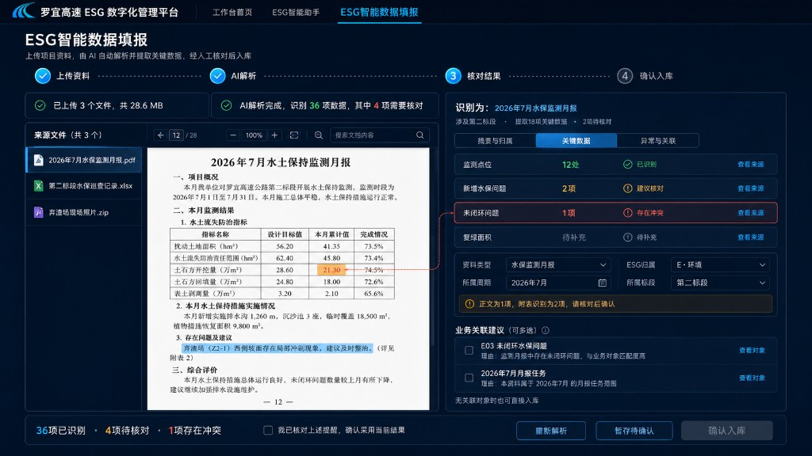
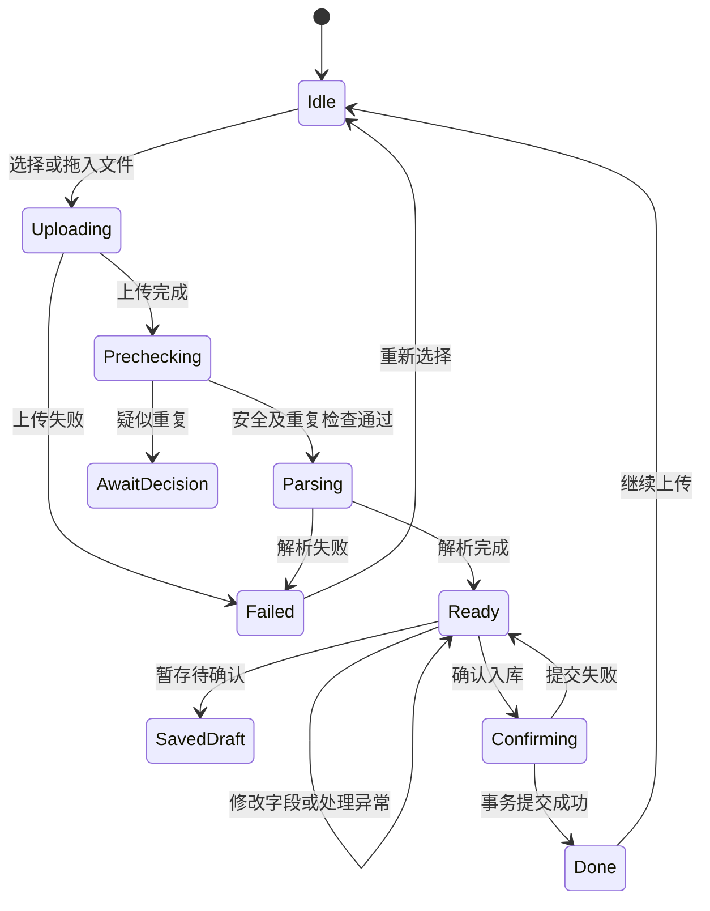

# ESG 智能数据填报｜一页式工作台设计与联调任务书 V0.2

> **交接位置：** `_handoff/ESG智能入库一页式/`（自 Downloads 入库，2026-07-26）  
> **取代：** `_handoff/Workspace_ESG智能入库页_简化流程设计_V0.1_20260726.md`（V0.1 简化单框说明 → **SUPERSEDED**）  
> **Trae 入口：** `_handoff/NEXT_FOR_TRAE.md`

| 项目 | 内容 |
|---|---|
| 版本 | V0.2 冻结候选 |
| 日期 | 2026-07-26 |
| 适用对象 | Trae / Cursor |
| 本轮目标 | 完成页面改造，并构造可上传、可解析、可核对、可确认入库、可回查的演示数据链 |
| 设计图 | 同目录 `ESG智能数据填报_一页式核对工作台_V0.2_20260726.png`（入库时若缺失请补入） |
| 数据性质 | 全部为 `demo/test`，不得进入正式 KPI、正式月报或正式档案统计 |

---

## 1. 本轮结论

将现有“上传区＋解析队列＋右侧 AI 双卡”的页面改为一个路由内的**一页式智能数据填报工作台**。

用户不再在四个页面之间切换，而是在同一页面完成：

> 上传资料 → AI 解析 → 对照原文核对和修正 → 选择业务关联 → 确认入库

页面根据任务状态重组主工作区：

| 状态 | 主界面 |
|---|---|
| 未上传 | 大尺寸统一上传入口 |
| 上传/解析中 | 当前资料包、真实上传进度、解析步骤和工作记录 |
| 待确认 | 左侧原文预览＋右侧结构化解析结果＋底部确认栏 |
| 已入库 | 入库结果摘要、生成记录、关联结果和“继续上传” |

本轮实施不能只把静态页面画出来。必须同步构造一套**可重复初始化、可实际上传、可跑通全流程、可清理恢复**的测试资料和演示数据。

---

## 2. 导航与页面边界

### 2.1 顶部一级导航

只显示：

> 工作台首页｜ESG智能助手｜ESG智能数据填报

其中“ESG智能数据填报”为当前激活项。

### 2.2 二级导航

整条隐藏，不保留高度和空白占位。以下入口本轮均不显示：

- 数据概览；
- 我的上传任务；
- 审核管理；
- 资料中心与档案。

本轮只隐藏入口，不擅自删除既有页面、路由、接口或后台能力。

### 2.3 禁止扩展范围

不得修改：

- 工作台首页；
- ESG 智能助手；
- 首页 KPI、GIS 地图和 E01～E04 弹窗；
- 碳核算独立页；
- 月报独立页；
- 正式库既有业务数据及统计口径。

---

## 3. 设计图说明

设计图绘制的是本页最核心的“解析完成、正在人工核对”状态。



### 3.1 顶部流程条

显示四个阶段：

1. 上传资料；
2. AI 解析；
3. 核对结果；
4. 确认入库。

流程条只是同一页面内的状态指示，不是页面跳转导航。

完成阶段收缩为摘要：

- `已上传 3 个文件，共 28.6 MB`；
- `AI 解析完成，识别 36 项数据，其中 4 项需要核对`。

用户可点击完成摘要重新展开，但默认不长期占据页面高度。

### 3.2 左侧原文区（约 55%）

包含：

- 资料包文件列表；
- PDF、图片、Word 阅读视图；
- Excel 工作表预览；
- 页码、缩放、旋转、搜索；
- AI 来源位置高亮；
- 当前字段与原文位置联动。

点击右侧“查看来源”时：

- PDF 跳转到对应页并高亮文本或表格区域；
- Excel 切换到对应 Sheet 并定位单元格；
- Word 定位对应段落；
- 图片定位 OCR 区域。

来源位置是可核验能力，不得只做无响应的装饰按钮。

### 3.3 右侧结果区（约 45%）

右侧是一张连续的“解析结果确认单”，包含三个页签：

- 摘要与归属；
- 关键数据；
- 异常与关联。

页签只切换右侧内容，不改变路由，不打开新页面。

字段状态统一为：

| 状态 | 颜色 | 处理要求 |
|---|---|---|
| 已识别 | 绿色/普通色 | 默认正常展示，可抽查来源 |
| 建议核对 | 黄色 | 允许用户确认或修改 |
| 存在冲突 | 红色 | 必须处理后才能入库 |
| 待补充 | 灰色 | 非必填可留空；必填项必须补充 |
| 已人工修正 | 蓝色 | 保留 AI 原值、人工值和修改人 |

关键元数据必须允许轻量修改：

- 资料名称；
- 资料类型；
- 所属周期；
- E/S/G 归属；
- 所属标段或工程对象；
- 编制单位、提交单位、责任单位；
- 是否作为正式资料；
- 归档目录。

### 3.4 业务关联

拆分为三类数据，不得继续混用一个 `acceptedCandidateIds` 表达全部关系：

| 数据类别 | 交互 | 示例 |
|---|---|---|
| 归属分类 | 单选 | E / S / G / 综合 / 暂不确定 |
| 业务关联 | 多选 | 事项、任务、工程对象、监测点位、月报、KPI |
| 资料归档 | 字段确认 | 类型、周期、单位、归档目录 |

AI 推荐项仅高亮并说明推荐依据，**默认不勾选**。

没有候选对象时仍可确认入库，并显示：

> 暂未发现可关联的业务事项，可先确认入库，后续补充关联。

### 3.5 底部固定操作栏

待确认时始终可见：

- 重新解析；
- 暂存待确认；
- 确认入库。

选择业务关联后，主按钮文案可变为“确认入库并关联”。

存在未处理的红色冲突或缺失必填项时，确认按钮禁用。黄色提醒可以入库，但必须由用户勾选：

> 我已核对上述提醒，确认采用当前结果。

---

## 4. 完整状态机



建议状态值：

`idle`、`uploading`、`prechecking`、`parsing`、`ready`、`draft`、`confirming`、`done`、`failed`、`cancelled`。

“取消”必须明确：

- 上传前移除文件：只清理本地选择；
- 上传/解析中取消：终止任务并清理临时文件、临时候选和未确认提取结果；
- 解析完成后放弃：按钮改为“放弃本次解析”，二次确认后清理临时结果；
- 已确认入库后不提供“取消”，后续撤销按资料管理业务执行。

---

## 5. 上传与解析进度

### 5.1 上传阶段

显示真实上传百分比、已上传字节和总字节。

### 5.2 解析阶段

优先使用后台真实进度。

若后台只能返回阶段状态，可显示明确标注的“流程进度”：

| 阶段 | 流程进度 |
|---|---:|
| 文件读取完成 | 15% |
| 文档分类完成 | 30% |
| 正文与表格提取完成 | 60% |
| 业务字段识别完成 | 80% |
| 异常检查与关联推荐完成 | 100% |

界面必须写成：

> 流程进度 60% · 正在提取正文与表格

不得将流程阶段比例伪装成模型的精确计算进度；无法提供比例时使用不定进度条，只显示“正在解析”和当前步骤。

---

## 6. 解析结果数据契约

以下为页面需要的**能力契约**，不是对现有函数名的冻结。实施前必须核查真实代码、数据库和接口，不得为迎合本文档重复创建同义接口。

### 6.1 解析任务

```json
{
  "jobId": "DEMO-INGEST-202607-001",
  "packageId": "DEMO-PKG-202607-001",
  "status": "ready",
  "progressType": "stage",
  "progress": 100,
  "currentStage": "match_candidates_completed",
  "dataNature": "demo",
  "isDemo": true,
  "summary": "本资料包为2026年7月第二标段水土保持监测月报及附件。",
  "fieldCount": 36,
  "reviewCount": 4,
  "conflictCount": 1
}
```

### 6.2 提取字段

每个字段至少包含：

```json
{
  "fieldId": "fld_open_issue_count",
  "fieldKey": "open_water_issue_count",
  "label": "未闭环问题",
  "aiValue": 1,
  "confirmedValue": null,
  "unit": "项",
  "confidence": 0.82,
  "reviewStatus": "conflict",
  "required": true,
  "source": {
    "fileId": "DEMO-FILE-001",
    "fileName": "2026年7月水保监测月报.pdf",
    "page": 12,
    "sheet": null,
    "cellRange": null,
    "textQuote": "未闭环问题数量较上月有所下降",
    "bbox": [0.16, 0.61, 0.78, 0.67]
  }
}
```

字段修改后必须保留：

- AI 原值；
- 用户确认值；
- 修改人；
- 修改时间；
- 修改原因或备注（红色冲突必填）。

### 6.3 异常记录

```json
{
  "anomalyId": "DEMO-ANOMALY-001",
  "type": "cross_file_conflict",
  "severity": "blocking",
  "message": "月报正文识别为1项，巡查附表识别为2项。",
  "relatedFieldIds": ["fld_open_issue_count"],
  "status": "pending",
  "resolution": null
}
```

异常处理动作：

- 采用 AI 结果；
- 采用另一来源结果；
- 手工输入；
- 标记为无需处理；
- 查看来源。

### 6.4 业务候选

```json
{
  "candidateId": "DEMO-CANDIDATE-E03-001",
  "relationType": "business_case",
  "targetType": "E03_WATER",
  "targetId": "DEMO-E03-ISSUE-001",
  "targetName": "E03 未闭环水保问题",
  "matchScore": 0.93,
  "reason": "资料中识别出第二标段未完成整改的水保问题。",
  "recommended": true,
  "selected": false
}
```

`recommended=true` 不等于 `selected=true`。

### 6.5 确认请求

确认请求至少区分：

```json
{
  "jobId": "DEMO-INGEST-202607-001",
  "classification": {
    "esgModule": "E",
    "documentType": "water_monitoring_monthly_report",
    "period": "2026-07"
  },
  "confirmedFields": [],
  "resolvedAnomalies": [],
  "selectedRelations": [],
  "archiveMetadata": {},
  "acknowledgedWarnings": true,
  "dataNature": "demo"
}
```

---

## 7. 必须构造的原始测试资料包

Trae/Cursor 必须在项目约定的 `fixtures`、`test-data` 或现有演示数据目录中构造以下资料。目录位置先核查项目规范，不得在生产上传目录散落文件。

### 7.1 资料包 A：正常＋冲突的主验收场景

资料包名称：

`DEMO_2026年7月第二标段水保月报资料包`

包含：

| 文件 | 内容要求 | 预期解析 |
|---|---|---|
| `2026年7月水保监测月报.pdf` | 28 页左右；正文写“未闭环问题 1 项”；含监测点位 12 处、新增问题 2 项、复绿面积 9800 m² | 识别为水保监测月报，周期 2026-07，E 模块，第二标段 |
| `第二标段水保巡查记录.xlsx` | 至少 12 条点位记录；其中 2 条状态为未闭环 | 与 PDF 产生“1 项 / 2 项”跨文件冲突 |
| `弃渣场现场照片.zip` | 3～5 张带日期和点位名的演示图片 | 作为原始证据保留；至少识别到弃渣场 Z2-1 |

固定期望值：

| 字段 | 期望 |
|---|---|
| 资料类型 | 水保监测月报 |
| 所属周期 | 2026年7月 |
| ESG 归属 | E·环境 |
| 所属标段 | 第二标段 |
| 监测点位 | 12 处 |
| 新增水保问题 | 2 项 |
| PDF 未闭环问题 | 1 项 |
| XLSX 未闭环问题 | 2 项 |
| 复绿面积 | 9800 m² |
| 阻断异常 | 1 条跨文件冲突 |

主验收时，用户把“未闭环问题”人工确认成 `2 项`，填写理由：

> 以巡查明细表逐条记录为准。

### 7.2 资料包 B：无业务候选仍可入库

文件：

`2026年7月临时环保培训签到表.jpg`

要求：

- 可识别资料名称、日期、组织单位；
- 不匹配任何现有事项或任务；
- 页面显示“暂未发现可关联事项”；
- 用户仍可直接确认入库；
- 最终只形成资料档案，不形成业务关联。

### 7.3 资料包 C：疑似重复

将资料包 A 的 PDF 复制一份并改名：

`2026年7月水保监测月报_再次上传.pdf`

要求：

- 通过文件哈希或内容指纹识别为疑似重复；
- 提示既有文件名称、入库时间和相似依据；
- 允许“取消上传”或“仍作为新版本上传”；
- 不得静默生成两份完全相同的正式档案。

### 7.4 资料包 D：解析失败

文件：

`损坏文件_解析失败测试.pdf`

要求：

- 文件可上传但解析失败，或由测试适配器稳定返回解析失败；
- 展示可理解的失败原因；
- 支持重新解析和重新选择文件；
- 不形成正式资料记录；
- 临时任务可被清理。

### 7.5 可选资料包 E：必填字段缺失

文件：

`无日期无责任单位的巡查说明.docx`

要求：

- 资料类型可识别；
- 周期和责任单位识别为空；
- 两项标记为“待补充”；
- 补齐前确认按钮禁用；
- 人工补齐后允许入库。

---

## 8. 演示业务底数

为保证关联推荐可测试，至少构造以下底数：

| ID | 类型 | 名称 | 状态 | 数据性质 |
|---|---|---|---|---|
| `DEMO-E03-ISSUE-001` | E03 水保事项 | 第二标段 Z2-1 弃渣场排水问题 | 整改中 | demo |
| `DEMO-E03-ISSUE-002` | E03 水保事项 | 第二标段 K18+500 边坡复绿不足 | 待复查 | demo |
| `DEMO-TASK-202607-001` | 月报任务 | 2026年7月水保月报归集 | 待提交 | demo |
| `DEMO-OBJECT-SEG02` | 工程对象 | 第二标段 | 有效 | demo |
| `DEMO-POINT-Z2-1` | 监测点位 | 弃渣场 Z2-1 | 有效 | demo |

候选推荐期望：

1. 推荐 `DEMO-E03-ISSUE-001`，匹配度约 0.90～0.95；
2. 推荐 `DEMO-TASK-202607-001`，匹配度约 0.85～0.92；
3. 推荐项默认均不勾选；
4. 用户可不选任何候选直接入库。

---

## 9. 数据隔离与初始化门禁

所有测试数据必须满足：

- `data_nature = 'demo'` 或项目现有等价字段；
- `is_demo = 1`；
- 使用固定前缀 `DEMO-INGEST-202607-`；
- 不进入正式 KPI 视图；
- 不进入正式月报统计；
- 不改变现有正式累计值；
- 不覆盖用户已有上传资料。

初始化必须幂等：

1. 重复执行不会新增重复记录；
2. 使用固定业务键或唯一键；
3. 提供清理脚本，只清理本任务固定前缀的演示记录；
4. 清理不得使用模糊全表删除；
5. 清理后再次初始化可以恢复到相同基线。

若现有表没有数据性质字段，先核查项目统一做法。不得为了本页面临时创建另一套与现有演示数据机制冲突的字段。

---

## 10. 后端与前端实现要求

### 10.1 先核查再复用

实施前只读核查：

- 当前上传接口；
- 解析任务模型和状态；
- 文件存储与临时文件清理；
- 已有解析字段和候选匹配结构；
- 确认入库事务；
- Workspace 刷新事件；
- 演示数据标识及 KPI 排除规则。

文档中的接口名均为能力描述。必须优先复用真实接口，不得重复创建：

- `startParseFile` / `createParseJob`；
- `getParseJob` / `queryParseStatus`；
- `getParseFields` / `getExtractedFields`；
- `getMatchCandidates` / `matchBusinessObjects`；
- `confirmParseJob` / `confirmIngestion`。

### 10.2 没有真实 AI 引擎时

允许增加**仅测试环境启用的确定性解析适配器**：

- 根据测试文件哈希或固定资料包 ID 返回预置解析结果；
- 与真实解析接口使用相同返回契约；
- 页面仍按真实异步任务状态运行；
- 必须通过环境开关启用；
- 生产环境默认关闭；
- UI 不得显示假装调用了真实大模型的文案；
- 后续接入真实引擎时只替换适配器，不重写页面。

### 10.3 事务要求

“确认入库”应作为一个事务处理：

1. 校验任务仍处于待确认；
2. 保存人工确认字段；
3. 保存异常处理结果；
4. 创建资料档案；
5. 创建选中的业务关系；
6. 写入审计记录；
7. 标记解析任务已完成；
8. 提交后刷新资料和任务视图。

任何一步失败均不得留下半入库状态。重复点击或网络重试必须通过幂等键防止重复建档。

---

## 11. 端到端验收脚本

### 11.1 主流程验收

1. 初始化演示底数和测试资料。
2. 打开“ESG智能数据填报”。
3. 确认顶部只有三个一级菜单，二级菜单完全隐藏。
4. 上传资料包 A 的三个文件，选择“作为一个资料包解析”。
5. 验证上传阶段显示真实百分比。
6. 验证解析阶段显示真实进度或明确的流程进度。
7. 解析完成后不跳转路由，直接进入双栏核对工作台。
8. 点击“未闭环问题”，左侧定位 PDF 来源。
9. 查看跨文件冲突，并切换到 XLSX 对应单元格。
10. 将确认值修改为 `2 项`，填写处理理由。
11. 确认推荐关联默认未勾选。
12. 勾选 E03 水保事项和 2026年7月月报任务。
13. 勾选“我已核对上述提醒”。
14. 点击“确认入库并关联”。
15. 验证成功提示：

> 已形成 1 份资料档案，关联 1 项水保事项和 1 项月报任务，写入经人工确认的结构化数据。

16. 回查数据库或现有资料查询能力，确认档案、字段、异常处理、关系和审计记录均存在。
17. 验证所有记录均为 demo，不进入正式 KPI。

### 11.2 无关联验收

1. 上传资料包 B。
2. 验证候选为空。
3. 验证“确认入库”仍可使用。
4. 入库后只生成档案，不生成业务关系。

### 11.3 重复文件验收

1. 上传资料包 C。
2. 验证系统提示疑似重复。
3. 选择“作为新版本上传”后，只增加同一档案的新版本或按现有版本机制处理。
4. 选择取消时，不生成孤立任务和档案。

### 11.4 失败恢复验收

1. 上传资料包 D。
2. 验证解析失败状态和原因。
3. 点击重新解析，状态可重新流转。
4. 放弃任务后，临时文件和临时解析结果被清理。

---

## 12. 验收门禁

以下任一项不满足，本轮不通过：

1. 仍显示二级导航；
2. 仍使用解析队列表格作为页面主体；
3. 上传、解析、核对、确认被拆成不同路由或不同页面；
4. 解析结果不能对照原文定位；
5. 关键元数据不可人工修改；
6. AI 推荐默认自动勾选；
7. 无候选时不能入库；
8. 显示没有依据的解析百分比；
9. 红色冲突未处理也能直接入库；
10. 只完成静态 mock，实际上传流程不能跑通；
11. 确认后只显示成功提示，但数据库没有形成可回查记录；
12. 测试数据进入正式 KPI、正式月报或覆盖既有业务数据；
13. 初始化不能重复执行或没有定向清理能力；
14. 为迎合任务书重复创建同义接口或另一套平行数据模型。

---

## 13. 建议实施顺序

1. 只读核查现有页面、接口、数据表和演示数据机制；
2. 输出“现有能力映射表＋实际修改文件白名单”；
3. 构造幂等演示底数和五类测试资料；
4. 打通上传、解析、字段来源、候选、确认事务；
5. 实现一页式三状态界面；
6. 跑通主流程、无关联、重复、失败恢复；
7. 执行类型检查、构建和相关自动化测试；
8. 按第 11 节逐项提供验收证据；
9. 用户完成页面和数据回查验收后，才可标记本轮完成。

---

## 14. Trae / Cursor 可直接执行的总指令

> 请依据《ESG智能数据填报｜一页式工作台设计与联调任务书 V0.2》及配套设计图实施。先只读核查现有代码、接口、数据库与演示数据机制，输出真实能力映射和修改白名单；不得直接照搬文档中的候选 API 名称创建同义接口。页面顶部只保留“工作台首页｜ESG智能助手｜ESG智能数据填报”，隐藏整条二级导航但不删除既有后台能力。将当前上传区、解析队列和右侧 AI 双卡改为一个路由内的单任务工作台：未上传时为统一上传入口，解析时显示真实上传进度和诚实解析进度，解析完成后切换为左侧原文预览、右侧结构化结果核对、底部固定确认栏。关键字段必须可修改，字段必须可定位来源；AI 推荐默认不勾选；无候选仍可入库；红色冲突必须处理后才能确认。
>
> 同时构造任务书第 7、8 节规定的演示资料包和关联业务底数，所有数据必须使用固定 DEMO 前缀、`is_demo=1` 或现有等价标识，且不得进入正式 KPI、正式月报和正式档案统计。初始化与清理必须幂等。若当前没有可用 AI 解析服务，可以新增仅测试环境启用的确定性解析适配器，但必须复用真实接口契约和异步状态流，生产环境默认关闭。必须实际上传资料包 A 跑通“上传—解析—原文定位—冲突处理—人工修正—选择关联—确认入库—数据库回查”，再跑通无关联、疑似重复、解析失败恢复三类场景。完成后提交修改文件清单、能力映射、初始化与清理方式、构建测试结果、每个验收场景的页面证据和数据库回查证据。未经确认不得改动工作台首页、ESG智能助手、GIS、首页 KPI、碳核算、月报独立页或正式业务数据。

---

## 15. 修订记录

| 版本 | 日期 | 说明 |
|---|---|---|
| V0.1 | 2026-07-26 | 简化上传与解析页面，仍偏静态流程说明 |
| V0.2 | 2026-07-26 | 改为一页式双栏核对工作台；隐藏二级导航；补充字段纠错、原文定位、异常处理、无关联入库、测试资料、演示底数、事务及端到端验收要求 |
