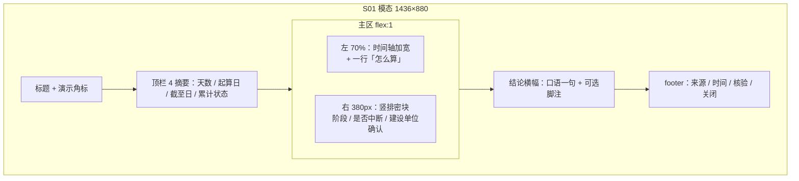

# S01 弹窗可读性与排版优化方案

**版本：** V0.1  
**日期：** 2026-07-25  
**状态：** **已确认 · Layout A′ 已实施（2026-07-25）**  
**权威口径：** `_handoff/S01_连续安全生产天数设计说明_B方案_V1.0冻结稿_20260724.md`（尤其 §3 重置规则、§3.4 最近一次重置、§8 B′ 模态）  
**对照实现：** `src/components/modal/S01SafetyProductionModal.vue`（A′：左主时间轴 + 右 390px 密排侧栏）  
**对照截图：** 演示态无重置（77 天 / 截至 2026-07-24 / 路基桥涵施工）  
**前序抛光：** `_handoff/S01_Trae返修任务单_P3_UI打磨_V1.0_20260725.md`（已做侧栏三块、结论下沉等；**本方案再往「普通人能读懂」推一步**）

---

## 0. 本文件定位（必读）

| 项 | 约定 |
|----|------|
| **本次交付** | 设计方案；**用户已确认 · Layout A′ 已落地** |
| **确认前** | ~~不得改代码~~（已过） |
| **确认后** | A′ 已实施于 `S01SafetyProductionModal.vue` + API 结论文案口语化 |
| **硬约束（不可破）** | 重置仍＝**责任事故 + 人员死亡 + 已认定**；演示主值 **77**；**不发明新 KPI 指标**；不恢复冻结 §8.3 禁止件（假趋势、六卡堆叠、宫格、督办等） |

---

## 1. 问题诊断

对照当前演示截图与组件结构，问题分三类，且互相叠加。

### 1.1 逻辑术语：内部口径直接上屏

| 现状用语 | 用户感受 | 根因 |
|----------|----------|------|
| 「最近一次重置」 | 不知道「重置」是什么；像系统开关 | 冻结术语「重置」= 重新起算连续天数，未做口语转译 |
| 「确认状态」+「批次：DEMO-…」 | 像后台字段；「谁确认的、确认什么」不清 | 建设单位月度确认被压成枚举词 |
| 「未发生触发重置的人员死亡安全生产责任事故」 | 吓人、拗口、一次读不完 | 把 §3.1 硬条件整句塞进辅区副文案 |
| 「计数状态 / 连续计数中」 | 偏程序态 | 可保留，但应用「还在安全累计」类口语解释更亲民（见 §3） |
| 「统计起点 / 统计期末」 | 尚可，但对非业务用户偏报表腔 | 可微调为「从哪天起算 / 统计到哪天」 |

**注意：** 口径本身正确（死亡责任事故才中断）。问题是**展示层把审计口径当标题/主句**，而不是「先说人话，口径放脚注」。

### 1.2 排版留白：主视觉错位导致「太空」

冻结 §8.2 规定：

1. 顶部摘要  
2. **主区＝连续计数时间轴**  
3. 辅区＝阶段 / 最近重置 / 确认  
4. 底部结论 + 来源  

当前实现（P3 抛光后漂移）：

```text
[ 顶栏 4 摘要卡 ]
[ 三列等高信息卡 ← flex:1，占掉大半高度，内容却只有 2～3 行 ]
[ 结论横幅 ]
[ 水平时间轴 ← 被挤到底部一条细带 ]
[ footer ]
```

结果：

- 三张卡垂直居中少数文字 → **中间大片空洞**（用户痛点）  
- 本应承担「主叙事」的时间轴变成脚注级装饰 → **逻辑故事讲不全**  
- 结论横幅与「重置」卡语义重复（都在说「没中断」）→ **信息重复却不更易懂**

### 1.3 描述口语化不足

- 结论句仍偏公文：「未发生触发重置的人员死亡…」  
- 无「怎么算出来的」一句通俗说明（冻结 §8.3 禁止「大段规则说教」，但**允许一句口语算法**，与「说教墙」有别）  
- 「批次」对领导层无意义；应降级为次要审计信息或 tooltip

---

## 2. 信息架构重排建议

### 2.1 推荐方案（A′）：主轴加宽 + 辅区合并为「读得懂的侧栏」

**原则：** 把 `flex:1` 还给时间轴；辅区变**窄而密**，不再三列等高抢高度。

```text
┌──────────────────────────────────────────────────────────────┐
│ S01 连续安全生产天数                          [演示数据] [×] │
├──────────────────────────────────────────────────────────────┤
│ [77 天]  [从 2026-05-08 起算]  [截至 2026-07-24]  [累计中]   │  ← 顶栏仍 4 格，标签口语化
├────────────────────────────────────────┬─────────────────────┤
│                                        │ 当前工期阶段         │
│         连续计数时间轴（主区加宽）      │ 路基桥涵施工         │
│                                        │ 路基填筑、桥梁…      │
│  ●─────────○─────────○─────────●       ├─────────────────────┤
│ 开工令   6月确认   7月确认   统计期末  │ 是否中断过           │
│ 05-08    06-01     07-01     07-24     │ 开工以来未中断       │
│                                        │ （脚注：见下方口径） │
│  [可选一行] 怎么算：从起算日到统计日    ├─────────────────────┤
│             的完整自然日，不开工日重算 │ 建设单位确认         │
│                                        │ 已确认 · 本轮月度    │
│                                        │ （批次号次要展示）   │
├────────────────────────────────────────┴─────────────────────┤
│ ✓ 一句话结论（口语）：开工以来到 7/24，已连续安全生产 77 天    │
├──────────────────────────────────────────────────────────────┤
│ 来源 / 更新 / 核验                              [关闭]       │
└──────────────────────────────────────────────────────────────┘
```

**空间分配建议（1436×880 壳内）：**

| 区域 | 建议高度/宽度 | 说明 |
|------|---------------|------|
| 顶栏摘要 | ~88px（可略收） | 保持 4 项，**不加第 5、第 6 卡** |
| 主区左：时间轴 | `1fr`，约 **70–75%** 宽 | 节点标签可带短 detail；垂直方向可用「轴 + 说明行」填满，避免空盒 |
| 主区右：辅区 | ~**380–400px** | **竖排 2～3 块密排**（阶段 / 是否中断 / 确认），块高随内容，**不要三列抢满高** |
| 结论 | 单行横幅 | 口语结论；与辅区「是否中断」不机械重复 |
| footer | 既有 | 不动壳逻辑 |

**无重置演示时，时间轴怎么「不空」：**

- 节点之间用短说明带：如「此段持续累计中」  
- 轴下方一行「怎么算」（见 §3 文案）  
- **禁止**为填空加：趋势图、30/60/90 节点、12 月宫格、证据表、六摘要卡

### 2.2 备选方案（B）：单列叙事（更密、更少框）

若希望彻底消灭「三空盒」：

```text
顶栏 4 摘要
────────────────
① 一句话结论（口语，大号一行）
② 怎么算（2～3 行通俗说明 + 脚注口径）
③ 全宽时间轴（加宽节点说明）
④ 底部一行元信息：工期阶段 · 是否中断 · 建设单位已确认
footer
```

- 优点：留白最少、阅读路径最顺  
- 代价：与冻结 §8.2「辅区三块」字面结构略远 → **需你确认是否算展示微调**（见 §5）

### 2.3 明确不采用

| 想法 | 原因 |
|------|------|
| 六卡 / 再加「死亡率」「事故数」等 KPI | 冻结禁止；且发明新指标 |
| 假趋势曲线填空 | §8.3 禁止 |
| 把「人员死亡…」放大成标题 | 吓人且不口语 |
| 三列卡继续 `flex:1` 居中 | 正是当前空洞根因 |

---

## 3. 文案对照表（现状 → 建议）

> 规则：**标题/主句用人话；冻结硬口径放脚注或「口径说明」折叠/小字。**  
> 演示无重置样例（77）下的建议文案如下。

### 3.1 辅区 / 侧栏

| # | 现状 | 建议（普通人能懂） | 备注 |
|---|------|--------------------|------|
| 1 | 标题「最近一次重置」 | **「是否中断过」** 或 **「连续天数是否中断」** | 「重置」留作技术/审计词，不进标题 |
| 2 | 主值「未发生」 | **「开工以来未中断」** | 有中断时：显示中断日期 + 短因 |
| 3 | 副文「自开工令起未发生触发重置的人员死亡安全生产责任事故」 | 副文：**「到目前为止，连续天数一直从开工日起算」**；脚注：**「仅当发生已认定的责任死亡事故时，才重新起算」** | 不把死亡句当大标题 |
| 4 | 标题「确认状态」 | **「建设单位确认情况」** | 点明主体 |
| 5 | 主值「已确认」 | 保持 **「已确认」**；可加半句 **「本轮月度已确认」** | |
| 6 | 「批次：DEMO-S01-20260724」 | **次要行**：`确认编号 DEMO-S01-20260724`；或 hover/小字 | 「批次」偏库表词 |
| 7 | 「当前工期阶段」 | 可保持；或 **「当前施工阶段」** | 微口语，非必须 |

### 3.2 顶部摘要

| # | 现状 | 建议 | 备注 |
|---|------|------|------|
| 8 | 连续安全生产天数 | 保持（指标名冻结） | 数字色仍建议 `#2f9cff` |
| 9 | 统计起点 | **「从哪天起算」** 或保留「统计起点」+ tooltip | 需确认是否改冻结用语 |
| 10 | 统计期末 | **「统计到哪天」** / 保持「截至 YYYY-MM-DD」值样式 | 值侧「截至」已较好 |
| 11 | 计数状态 / 连续计数中 | **「累计状态」/「累计中」**；待认定→**「有事故待认定」**；已重置→**「已重新起算」** | 枚举语义不变，仅标签 |

### 3.3 结论横幅（演示无重置）

| # | 现状（冻结 §8.2 示范句偏公文） | 建议口语主句 | 脚注口径（小字，可选） |
|---|--------------------------------|--------------|------------------------|
| 12 | 「…未发生触发重置的人员死亡安全生产责任事故」 | **「项目开工以来，截至 2026-07-24，已连续安全生产 77 天，期间未因责任死亡事故中断。」** | 「重新起算条件：安全生产责任事故，且造成人员死亡，且责任认定已生效。」 |

### 3.4 「怎么算」一句（填信息、非说教墙）

| # | 建议文案 | 边界 |
|---|----------|------|
| 13 | **「怎么算：从起算日到统计日，按完整自然日累计；起点当天记 0 天。数字由建设单位确认快照给出，页面不自行重算。」** | 控制在 **1～2 句**；禁止展开成长文规则墙（§8.3） |

### 3.5 有重置 / 待认定时（预留，非演示主路径）

| 场景 | 建议展示 |
|------|----------|
| 已生效重置 | 「是否中断过」→ **「已中断 · YYYY-MM-DD 起重新累计」**；原因摘要一行；勿用「重置」作吓人标题 |
| 待认定 | 顶栏状态 **「有事故待认定」**；辅区提示 **「认定结果出来前，连续天数暂不改；若认定为责任死亡事故，将按事故发生日追溯」** |

---

## 4. 布局线框

### 4.1 推荐 A′（mermaid）



### 4.2 ASCII（无重置演示）

```text
+======================================================================+
| S01  连续安全生产天数                         [演示数据]         [x] |
+----------------------------------------------------------------------+
|  77天          2026-05-08        截至 2026-07-24         累计中     |
| 连续安全生产天数  从哪天起算         统计到哪天            累计状态   |
+------------------------------------------+---------------------------+
|                                          | 当前施工阶段              |
|   开工令        6月确认      7月确认     | 路基桥涵施工              |
|     ●-------------○------------○------●  | 路基填筑、桥梁基础…       |
|   05-08         06-01        07-01  07-24|                           |
|                              统计期末    | 是否中断过                |
|                                          | 开工以来未中断            |
|  怎么算：从起算日到统计日的完整自然日；  | 小字：责任死亡且已认定才  |
|  数字来自确认快照，页面不重算。          |       重新起算            |
|                                          |                           |
|                                          | 建设单位确认情况          |
|                                          | 已确认 · 本轮月度         |
|                                          | 确认编号 DEMO-S01-…       |
+------------------------------------------+---------------------------+
| ✓ 开工以来到 7/24 已连续安全生产 77 天，未因责任死亡事故中断。        |
+----------------------------------------------------------------------+
| 数据来源…  更新时间…  核验状态…                              [关闭] |
+======================================================================+
```

### 4.3 相对现状的改动要点（实现时对照，**本轮不改代码**）

| 现状问题 | 方案动作 |
|----------|----------|
| `.info-cards-grid { flex:1 }` 三列等高空心 | 取消三列满高；改为 **左主右辅** 或 **单列叙事** |
| 时间轴在结论下方、高度被压扁 | 时间轴升为 **主区主体** |
| 「重置/死亡」长句占副文 | 主句口语 + **脚注口径** |
| 结论与中断卡同义重复 | 结论偏「结果叙事」；侧栏偏「有没有中断过」 |

---

## 5. 与冻结稿冲突点（需你确认是否微调冻结表述）

下列项**不是悄悄改口径**，而是展示用语/结构是否允许相对 V1.0 冻结稿微调。请逐条拍板：

| ID | 冻结表述 / 结构 | 本方案建议 | 冲突性质 | 请你确认 |
|----|-----------------|------------|----------|----------|
| C1 | §8.2 辅区标题含「最近一次重置」 | 改为「是否中断过」等口语标题；「重置」退居脚注/技术词 | **展示用语** | □ 同意微调　□ 标题必须保留「重置」 |
| C2 | §3.4 / §8.2 无重置文案偏「未发生触发重置的…人员死亡…」 | 主句改口语；死亡责任条件改脚注 | **展示用语**（硬条件不变） | □ 同意　□ 主句必须保留冻结原句 |
| C3 | §8.2 无重置结论示范句 | 结论口语化（见 §3.3 #12） | **展示用语** | □ 同意改结论句　□ 结论句锁定冻结原文 |
| C4 | §8.2「确认状态」 | 「建设单位确认情况」 | **展示用语** | □ 同意　□ 保持「确认状态」 |
| C5 | §8.2 结构：主区时间轴 + 辅区三块 | A′：侧栏竖排三块（推荐，仍符合精神）；B：单列叙事更密 | **版式** | □ 采纳 A′　□ 采纳 B　□ 维持现状三列 |
| C6 | §8.3 禁止「大段计数规则说教」 | 增加 **1～2 句「怎么算」** | **边界** | □ 允许一句算法　□ 完全不要算法说明 |
| C7 | 顶栏「统计起点/期末/计数状态」 | 口语标签（从哪天起算等） | **展示用语** | □ 可改标签　□ 顶栏标签冻结不动 |
| C8 | P3 抛光单要求侧栏标题「最近一次重置」 | 本方案提议再改口语 | **与前序任务单** | 确认后以后者为准写新实施单 |

**不可谈判（方案声明遵守，不请你放宽）：**

- 重置硬条件仍＝责任事故 + `fatality_count>=1` + 已认定  
- 演示无重置验收样例仍＝**77**（as_of 2026-07-24，开工 2026-05-08）  
- 不发明新 KPI、不恢复 §8.3 禁止组件、不改首页 S01 卡结构、前端不重算主值  

---

## 6. 建议确认后的实施边界（预告，非开工）

确认本方案后，建议另开短实施单，范围大致：

1. **仅** `S01SafetyProductionModal.vue` 布局 + 文案映射（及必要时 API `conclusion` 演示句口语化）  
2. 不重开 P1 Schema / P2 闸门合同  
3. 验收：无重置演示截图「中间不空、术语能懂」；77 / 路基桥涵施工 / DEMO 角标 / 无 §8.3 回流  
4. 验证：`npm run check` / `npm run build`

---

## 7. 本次明确不做

- **不改代码、不提交、不发 READY_for_trae**  
- 不改重置业务规则与测数  
- 不用假数据/假图填空  
- 不把本方案写成已冻结设计；冻结变更以你对 §5 勾选为准，必要时补一页「展示用语勘误」挂到门禁 105  

---

## 8. 给确认方的一句话

> 中间空洞来自「三列空心卡抢了主高度、时间轴被挤扁」；读不懂来自「重置/批次/人员死亡责任事故」直接当标题。建议：**时间轴回主位 + 侧栏密排口语三块 + 死亡口径改脚注**；硬规则与 77 天不动。请先勾选 §5，再授权改 UI。
