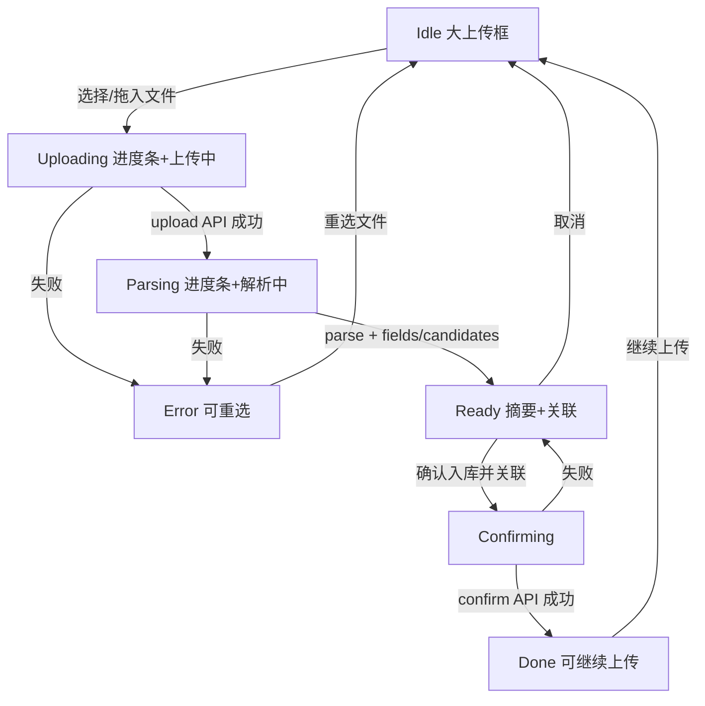

# Workspace「ESG智能入库」页 — 简化流程设计 V0.1

> **SUPERSEDED（已被取代）**  
> 本文档为 2026-07-26 早间简化流程说明（静态单框：上传→解析→摘要→关联→确认），**不再作为实施依据**。  
> 正式 Trae / Cursor 任务书与设计以 **V0.2** 为准：  
> `_handoff/ESG智能入库一页式/ESG智能数据填报_一页式工作台设计与联调任务书_V0.2_20260726.md`  
> （一页式双栏核对工作台 + 演示资料/底数 + 端到端联调验收；含隐藏二级导航、原文定位、冲突处理、事务入库等）。

| 项 | 内容 |
|----|------|
| 版本 | V0.1 |
| 日期 | 2026-07-26 |
| 状态 | **SUPERSEDED by V0.2**（保留仅供对照；勿按本文实施） |
| 取代文档 | `_handoff/ESG智能入库一页式/ESG智能数据填报_一页式工作台设计与联调任务书_V0.2_20260726.md` |
| 范围页 | Workspace 二级 Tab「ESG智能入库」（V0.1 设想；V0.2 改为一级「ESG智能数据填报」且隐藏二级导航） |
| 主文件（未来实施） | `WorkspaceSmartUpload.vue`、`WorkspaceNav.vue`、必要时 `workspace.scss` |
| 基线 | `baseline/workspace-ui-20260726` |

---

## 1. 设计目标

把当前「上传区 + 解析队列表格 + 右侧 AI 摘要/推荐」的多栏仪表盘，收敛为**单一主流程页**：

```
上传 → 智能解析 → 摘要 → 关联 → 用户确认入库
```

**原则：**

- **不展示多余数据**：去掉队列、分页、筛选、批量操作、假队列（如 200+ 条 mock）。
- **整页 = 上传 + 分析页**：主内容区只有一块大框，完成从选文件到确认的全过程。
- **智能感落在流程上**：进度与状态文案清晰；解析成功后立刻给摘要与可勾选关联；由用户点「确认入库并关联」。

---

## 2. 用户需求对照

| # | 需求 | 设计响应 |
|---|------|----------|
| 1 | 二级 Tab 字号偏小（填报概览、我的上传任务等） | `WorkspaceNav` 五 Tab 统一加大到约 **15–16px** 或 `var(--fs-nav)` / `var(--fs-body)`，**五 Tab 一致** |
| 2 | 去掉「解析队列」整块 | 删除表格、状态筛、搜索、分页、批量重解析/清除失败 |
| 3 | 去掉右侧「AI解析摘要」「AI智能推荐」 | 删除右栏；摘要与关联**内嵌**到主框流程内 |
| 4 | 单一大「上传/智能填报」主框 | 单列、占满主内容区，高度宽松 |
| 5 | 放入文件后显示进度条 | 主框内进度条（上传→解析共用一条，或分段同一视觉） |
| 6 | 状态文案「解析中」等 | 明确阶段文案：上传中 / **解析中** / 解析完成 / 入库中 / 已入库 |
| 7 | 成果＝摘要 | 类型、周期、ESG 模块、关键指标等（来自真实解析字段） |
| 8 | 关联到事项/任务/ESG模块 | 勾选或点选推荐关联项（来自 match-candidates） |
| 9 | 用户确认入库 | 主 CTA「确认入库并关联」；取消为次要 |

**保留（次要操作）：**「下载样例文件」放在上传区附近，不升主 CTA。

---

## 3. 信息架构：去掉 vs 保留

### 3.1 去掉（本页不再出现）

| 模块 | 说明 |
|------|------|
| 解析队列面板 | 标题、状态 Tab、搜索、表格、进度列、分页、批量按钮 |
| 右栏 AI解析摘要卡 | 独立侧栏双击编辑密集字段表 |
| 右栏 AI智能推荐卡 | 独立侧栏分页推荐列表、「复用并关联 / 忽略」等 |
| 假队列数据依赖 | 页加载时拉满/展示 mock 队列条目 |
| 「批量导入」「从资料中心选择」 | 当前为原型预留；本简化版可不进主路径（可选后续） |
| 「仅保存到资料中心」 | 简化版建议拿掉，避免与「确认入库并关联」双路径争抢；若业务坚持可作次要，默认不做 |

### 3.2 保留 / 迁入主框

| 能力 | 位置 |
|------|------|
| 拖拽 / 选择本地文件 | 主框 idle 态 |
| 下载样例文件 | 上传区旁次要按钮 |
| 上传 API + 解析 API | 选文件后触发 |
| 进度条 + 状态文案 | 主框 parsing 态 |
| 摘要字段（类型/周期/模块/关键指标/置信度等） | 主框 ready 态「摘要」区 |
| 关联候选勾选 | 主框 ready 态「关联」区 |
| 确认入库并关联 / 取消 | 主框底部操作 |
| 工作区刷新事件 | 确认成功后 `emitWorkspaceRefresh`（scopes 可含 tasks/documents；不再依赖 queue UI） |

### 3.3 二级导航（全 Workspace 共用）

仅调字号与必要 padding，**不改** Tab 文案、数量、路由 key。

---

## 4. 线框

### 4.1 页面结构（单列）

```
┌─────────────────────────────────────────────────────────────┐
│ HeaderNav（平台顶栏 · 本设计不改）                              │
├─────────────────────────────────────────────────────────────┤
│ WorkspaceNav  [填报概览] [我的上传任务] [ESG智能入库*] …        │  ← 字号 ↑
├─────────────────────────────────────────────────────────────┤
│                                                             │
│  ┌─ ws-panel · 主框（占满 main）──────────────────────────┐  │
│  │  标题：ESG智能入库 / 智能数据填报                        │  │
│  │                                                       │  │
│  │  【随状态切换同一区域内容，见 §5】                        │  │
│  │                                                       │  │
│  └───────────────────────────────────────────────────────┘  │
│                                                             │
└─────────────────────────────────────────────────────────────┘

已删除：左下解析队列 │ 右侧双卡
```

### 4.2 状态线框（ASCII）

**A · Idle（待上传）**

```
┌────────────────────────────────────────┐
│ ESG智能入库                             │
│                                        │
│     ┌ ─ ─ ─ ─ ─ ─ ─ ─ ─ ─ ─ ─ ┐     │
│     │     ↑ 上传图标              │     │
│     │  将文件拖拽到此处，或选择上传 │     │
│     │  格式说明…                  │     │
│     │  [选择本地文件]  [下载样例]   │     │
│     └ ─ ─ ─ ─ ─ ─ ─ ─ ─ ─ ─ ─ ┘     │
│         （大面积虚线框，高度宽松）      │
└────────────────────────────────────────┘
```

**B · Parsing（解析中）**

```
┌────────────────────────────────────────┐
│ ESG智能入库          文件名.xxx         │
│                                        │
│              解析中                     │
│     ████████████░░░░░░░░  62%          │
│                                        │
└────────────────────────────────────────┘
```

**C · Ready（摘要 → 关联 → 确认）**

```
┌────────────────────────────────────────┐
│ ESG智能入库          文件名.xxx         │
│ 解析完成 · 进度 100%                    │
│                                        │
│ ▸ 摘要                                 │
│   资料类型 ……    资料周期 ……           │
│   ESG模块  E·环境   关键指标 …          │
│   置信度   xx%                         │
│                                        │
│ ▸ 关联（事项 / 任务 / ESG模块）          │
│   ☑ 任务A  E · 匹配度 92%              │
│   ☐ 任务B  S · 匹配度 71%              │
│                                        │
│              [取消]  [确认入库并关联]    │
└────────────────────────────────────────┘
```

### 4.3 流程（Mermaid）



---

## 5. 步骤状态定义

| 状态 | 文案（主状态） | UI 要点 | 用户可操作 |
|------|----------------|---------|------------|
| `idle` | — | 大虚线上传区；样例下载 | 选文件 / 拖入 / 下载样例 |
| `uploading` | 上传中 | 进度条起步～中段 | 一般不可打断；可选取消回 idle |
| `parsing` | **解析中** | 进度条推进；文件名可见 | 同左 |
| `ready` | 解析完成 | 摘要区 + 关联勾选 + CTA | 勾选关联、确认、取消 |
| `confirming` | 入库中 | 短进度或按钮 loading | 禁用重复提交 |
| `done` | 已入库 | 成功提示；「继续上传」 | 回 idle |
| `error` | 上传失败 / 解析失败 | 错误信息 + 回到可上传 | 重选文件 |

**进度条策略（实施指引，非本阶段代码）：**

- 若存在异步 parse job：轮询 `getParseJob`，进度尽量贴 job；文案保持「解析中」直至终态。
- 若同步/秒级返回：前端动画进度（勿卡在 0%），完成后到 100% 并切 `ready`。
- **禁止**为了填进度而伪造数百条队列文件。

---

## 6. 摘要与关联内容契约

### 6.1 摘要（优先真实解析字段）

来源：`getParseFields` / `getParseJob`（及现有 `content_parser` 映射逻辑）。

| 展示项 | 典型 fieldKey / 来源 |
|--------|----------------------|
| 资料类型 | `document_type` |
| 资料周期 | `period` |
| ESG 模块 | `esg_module` / `module` |
| 责任单位 / 标段 / 工程对象 / 有效期 | 现有字段映射 |
| 关键指标 | 业务关键 keys（如超标次数、监测日期、摘要说明等） |
| 置信度 | job.confidence 或字段均值 |
| 引擎摘要一句 | job.summary（可选弱展示） |

无真实字段时：诚实空态提示「未能识别，可仍选择关联后入库或重新上传」，**不要**用假摘要充数。

### 6.2 关联

来源：`getMatchCandidates`。

- 列表项：任务名、模块、匹配度、匹配依据（可选）。
- 交互：checkbox 多选；默认勾选最高匹配。
- 确认时：`acceptedCandidateIds` 传给 `confirmParseJob`（与现 API 对齐）。

---

## 7. 数据 / API 复用说明

**只复用现有 Workspace 上传解析链路，不新造队列产品。**

| API | 用途 |
|-----|------|
| `uploadWorkspaceBinaryFile` | 选文件后上传 |
| `startParseFile` | 启动解析 |
| `getParseJob` | 状态/摘要/置信度；异步时轮询 |
| `getParseFields` | 摘要字段 |
| `getMatchCandidates` | 关联候选 |
| `confirmParseJob` | 确认入库并关联 |

**可停用（本页 UI 层）：**

- `getParseQueue` 及队列列表渲染（后台队列可仍存在，**本页不展示**）。
- mock `parseQueue` 驱动的表格。

**刷新：** 确认成功后继续 `emitWorkspaceRefresh`，scopes 建议 `summary` / `tasks` / `documents`；`parse-queue` 可保留事件兼容，但无 UI 消费亦可。

---

## 8. 视觉与格式约束

- **仅** Workspace 局部：`workspace.scss` 的 `.ws-*`（panel、btn、progress、page-message 等）。
- 主框用 `.ws-panel`；按钮用 `.ws-btn` / primary / secondary。
- 不引入新设计语言、不新开全局 token（`layout.scss` / `tokens.scss` 禁止为完成本页而改）。
- Nav 字号：统一约 15–16px 或现有 `--fs-nav` / `--fs-body`，五 Tab 一致。
- 1920×1080 `screen-canvas` 壳不变。

---

## 9. 明确不在范围（Out of Scope）

| 禁止 | 说明 |
|------|------|
| Dashboard / GIS / L1–L2 | 不碰 |
| ESG 智能助手页 | 不碰 |
| 碳核算 / 月报独立页 | 不碰（并行 sprint） |
| Workspace 其他 Tab 业务内容 | 填报概览、上传任务、审核、资料中心**内容逻辑**不改；仅共用 Nav 字号 |
| 后端解析引擎大改 / 新假数据队列 | 不做 |
| 本阶段任何产品功能代码合入 | **仅出设计**；实施另开 Trae 任务单 |

---

## 10. 未来实施文件白名单（供任务单引用）

| 文件 | 允许改动 |
|------|----------|
| `src/components/workspace/WorkspaceSmartUpload.vue` | 主：按本设计重排交互与布局 |
| `src/components/workspace/WorkspaceNav.vue` | 仅字号/必要间距 |
| `src/styles/workspace.scss` | 仅必要时补 `.ws-*` 或本页共用进度样式；最小改动 |
| 其他 | **默认禁止** |

---

## 11. 验收口径（设计评审用 · 实施后对照）

1. 打开「ESG智能入库」：无解析队列、无右侧双卡；主区一块大框。
2. Nav 五 Tab 字号明显大于当前 14px 观感，且彼此一致。
3. 选文件后可见进度条 +「解析中」（及后续完成态文案）。
4. 成功后主框内见摘要 + 可勾选关联 +「确认入库并关联」/「取消」。
5. 「下载样例文件」仍在上传附近且为次要。
6. 未改 Dashboard / Assistant / 碳月报 / 其他 Workspace Tab 内容。
7. 不出现假大队列；进度绑定真实 job 或诚实动画。

---

## 12. 修订记录

| 版本 | 日期 | 说明 |
|------|------|------|
| V0.1 | 2026-07-26 | 首版简化流程设计；明确本阶段仅文档、不实施代码 |
