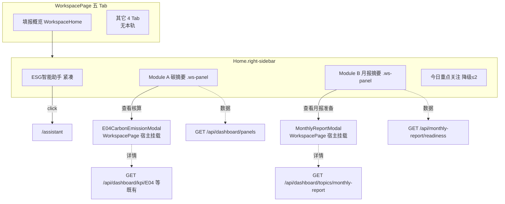

# Workspace 右侧 · 碳与月报模块设计 V0.1

> ## SUPERSEDED · 2026-07-26（用户修订）
>
> **本设计方向已作废，禁止按本文实施。**
>
> - **错误方向：** Workspace「填报概览」右侧栏摘要 + 下钻 E04 / MonthlyReportModal  
> - **中间错误方向（亦已废止）：** 单一「碳核算与月报」四 Tab 合并页（`_handoff/碳核算与月报独立页/作废/碳与月报独立页设计_V0.1_20260726.md` · **SUPERSEDED**）  
> - **正确方向：** **两个独立顶层页**——碳核算 `/#/carbon` 与 月报 `/#/monthly-report`  
> - **继任设计：**  
>   - `_handoff/碳核算与月报独立页/碳核算独立页设计_V0.1_20260726.md`  
>   - `_handoff/碳核算与月报独立页/月报独立页设计_V0.1_20260726.md`  
> - **继任开工令：**  
>   - `_handoff/碳核算与月报独立页/Trae实施任务单_碳核算独立页_V1.0_20260726.md`  
>   - `_handoff/碳核算与月报独立页/Trae实施任务单_月报独立页_V1.0_20260726.md`  
>
> 下文仅作历史对照，**不得**作为 Trae 实施依据。

| 项 | 内容 |
| --- | --- |
| **日期** | 2026-07-26 |
| **版本** | V0.1（**SUPERSEDED** · 原右栏方案） |
| **范围** | ~~数据填报（Workspace）填报概览右侧栏增加碳摘要 + 月报摘要~~ → 已废止 |
| **非范围** | （历史） |
| **实施依据** | ~~`_handoff/碳核算与月报独立页/作废/Trae实施任务单_Workspace右侧碳与月报_V1.0_20260726.md`~~ → 同批 **SUPERSEDED** |

---

---

## 0. 基线与红线（实施绑定）

| 项 | 要求 |
| --- | --- |
| **开工 Tag** | `baseline/workspace-ui-20260726`（见 `_handoff/BASELINE_Workspace_UI_20260726.md`） |
| **首页保护 Tag** | `baseline/l1-l2-gis-20260726`（两 tag 共存，勿删） |
| **回退** | `git switch --detach baseline/workspace-ui-20260726` |
| **ALLOWED** | `WorkspacePage`、`components/workspace/**`、`workspace.scss`；`api.ts` 仅薄读 carbon/monthly（无新 schema） |
| **FORBIDDEN** | `DashboardPage`、GIS/`traffic-gis-overview`、e01/e02/e03/s02、`HeaderNav`、`AssistantPage`/`assistant/*`、`layout.scss` 全局 tokens、`CarbonBenefitPanel`/`MonthlyReportPanel` **源码重写**（可读 API）、S01–G04 模态内部 |
| **版式** | 必须 `.ws-panel` / `.ws-btn-*` / `--ws-*`；**禁止新视觉语言** |


## 1. 目标与原则

1. **版式**：沿用现有 Workspace UI（`workspace.scss` + `.ws-panel`），不做首页右栏复刻，不换肤。
2. **数据**：复用首页已接通的 live API / 同源口径；**禁止编造数字**；UI 不出现「演示 / 测试 / 未确认」chrome。
3. **放置**：**仅**「填报概览」(`WorkspaceHome`) 右侧栏；其余四个二级 Tab **不挂**本轨，避免打散各页布局、破坏五 Tab。
4. **红线**：不改 Dashboard GIS/L1/L2、HeaderNav chrome、Assistant 页；不改首页右栏组件本体（可只读复用其数据契约）。

---

## 2. 现状（对照）

### 2.1 首页右栏（数据源权威）

| 模块 | 组件 | Store / API | 主展示 |
|------|------|-------------|--------|
| 碳足迹与低碳增益 | `CarbonBenefitPanel.vue` | `dashboard.store` ← `GET /api/dashboard/panels` → `carbon.metrics` / `carbon.sources` / `carbon.reductions` | 3 指标 + 来源环图 + 减排措施 |
| 月报准备与输出 | `MonthlyReportPanel.vue` | `dashboard.store.monthlyReadiness` ← `GET /api/monthly-report/readiness?reportPeriod=` | 归集率环 + 状态计数 + 待处理列表 |
| 点击下钻（首页） | `DashboardPage` `handleTopicSelect` | 碳：`GET /api/carbon/benefit-overview`；月报：`GET /api/dashboard/topics/monthly-report` | `KpiDetailModal` / `MonthlyReportModal` / E04 详情 |

另有 Master 壳层 `MasterCarbonPanel` / `MasterMonthlyReportPanel`（`master.mock`），**本设计不以 Master mock 为口径**；Workspace 对齐 **Dashboard 活面板 + MySQL API**。

### 2.2 E04 / 甲方 7.14 口径（碳）

权威摘录：`_handoff/E04_甲方7.14数据重构与设计基线_20260724.md`

| 项 | 口径 |
|----|------|
| 边界 | 施工用油 + 施工用电 + 主要材料；**运输暂不纳入** |
| 统计起点 | 2026-05-08 |
| 核算期间（当前批次） | 2026-05 — 2026-07 |
| 累计主值 | ≈ **6174.99** tCO₂e（精确）；首页 KPI / 面板常见展示 **6175**（取整） |
| 名称 | 首页 E04＝**项目累计碳排放**；面板文案「施工阶段累计碳足迹」与专题同源 |

Workspace 摘要卡展示时：**与 `CarbonBenefitPanel` 同源字段与格式化**（`toLocaleString` / 面板 `metrics[].value`），不得另写硬编码 6175。精确值下钻进 E04 模态后由既有详情接口呈现。

### 2.3 月报口径

| 项 | 口径 |
|----|------|
| 主指标名 | 月报资料归集率 |
| 默认周期 | `reportPeriod=2026-07`（与 store `loadMonthlyReadiness` 默认一致） |
| 计算 | `numerator` / `denominator` → `progress`（校验通过 / 计入分母项） |
| 表族 | `monthly_report_cycle`、任务实例 / validation / material link（见 readiness 实现 `server/monthly_report_readiness.py`） |
| 面板字段 | 期次名、归集率、已归集 n/m、待提交/待确认/待补正计数、截止日区间、exceptionTasks |

### 2.4 Workspace 现状右栏

`WorkspaceHome.vue` → `.right-sidebar`：

1. **ESG 智能助手**（紧凑入口卡 → `/assistant`）
2. **今日重点关注**（`todayFocusList` mock，最多 4 条）

左栏：6 状态卡 + 智能入库快捷 + 我的上传任务表。栅格：`1fr | clamp(420px, 26vw, 500px)`。

---

## 3. 信息架构（IA）

### 3.1 放置结论

| 问题 | 结论 |
|------|------|
| 挂在哪？ | **仅填报概览** `WorkspaceHome` 右侧栏 |
| 其它 Tab 是否显示？ | **否**（tasks / smart-upload / review / documents 保持现布局） |
| 五 Tab 是否改动？ | **否**；文案与 `?t=` 深链不变 |
| 是否改首页右栏？ | **否** |

### 3.2 文本线框

```
┌─ Workspace / 填报概览 ─────────────────────────────────────────┐
│ ┌─ main-content ──────────────┐  ┌─ right-sidebar ───────────┐ │
│ │ [6 状态卡]                  │  │ ┌ ws-panel 助手(紧凑) ──┐ │ │
│ │ [智能入库 上传|批量]        │  │ │ Hi… → /assistant      │ │ │
│ │ [我的上传任务 表+分页]      │  │ └──────────────────────┘ │ │
│ │                             │  │ ┌ ws-panel 碳摘要 ─────┐ │ │
│ │                             │  │ │ 累计碳足迹 · 减排…   │ │ │
│ │                             │  │ │ 来源 Top3 条          │ │ │
│ │                             │  │ │ [查看核算]            │ │ │
│ │                             │  │ └──────────────────────┘ │ │
│ │                             │  │ ┌ ws-panel 月报摘要 ───┐ │ │
│ │                             │  │ │ 2026年7月月报 · 82%  │ │ │
│ │                             │  │ │ 待处理 3～4 条        │ │ │
│ │                             │  │ │ [查看月报准备]        │ │ │
│ │                             │  │ └──────────────────────┘ │ │
│ │                             │  │ ┌ ws-panel 今日重点 ───┐ │ │
│ │                             │  │ │ 降级：最多 2 条       │ │ │
│ │                             │  │ └──────────────────────┘ │ │
│ └─────────────────────────────┘  └───────────────────────────┘ │
└────────────────────────────────────────────────────────────────┘
```

### 3.3 Mermaid



---

## 4. Module A · 碳摘要

### 4.1 展示字段（紧凑，非首页整板复刻）

| # | 字段 | 来源路径 | 对照首页 |
|---|------|----------|----------|
| A1 | 标题「碳足迹与低碳增益」 | 固定文案（与 `CarbonBenefitPanel` 标题一致） | 同左 |
| A2 | 施工阶段累计碳足迹 + unit | `panels.carbon.metrics[]` 中 label 匹配项 | 面板第 1 卡 |
| A3 | 累计核算减排量 + unit | 同上 | 面板第 2 卡 |
| A4 | 低碳措施节约成本 + unit | 同上 | 面板第 3 卡（`CarbonBenefitPanel` 已滤掉「较基准下降」） |
| A5 | 来源构成 Top3：name + 占比% | `panels.carbon.sources` 按 value 归一化占比 | 「碳足迹来源构成」图例精简 |
| A6 | （可选一行）边界提示纯文案 | 固定短句：「边界：油/电/材料；运输暂不纳入」——**无数值** | 甲方 7.14；勿加演示角标 |

**不做（本版）：** RingChart 整图、减排措施条、成本专题全表、碳专题多 Tab。

### 4.2 数据源

| 层 | 路径 |
|----|------|
| HTTP | `GET /api/dashboard/panels` → `carbon` |
| 服务端 | `mysql_api.get_dashboard_panels` → `get_carbon_panel_data` ← `get_carbon_topic_detail` / `carbon_benefit_overview` |
| 表 | `carbon_emission_activity`、`carbon_accounting_batch`、`carbon_accounting_boundary`、`carbon_material_usage`、`carbon_emission_factor`、`carbon_reduction_*` |
| 前端调用 | 优先复用 `getDashboardPanels()`（`api.ts` 已有）；**勿**在 Workspace 硬编码 6175 |
| 回落 | API 失败时可静默用与首页相同的 mock 结构（`dashboard.mock` 的 `carbonMetrics`/`carbonSources`），交付说明写清；界面不标「演示」 |

### 4.3 与首页对照

| | 首页 `CarbonBenefitPanel` | Workspace Module A |
|--|---------------------------|---------------------|
| 容器 | `PanelCard`（大屏） | `.ws-panel`（Workspace） |
| 指标 | 3 卡大字号 | 2～3 行紧凑 metric |
| 来源 | RingChart + 全图例 | Top3 文本行 |
| 减排措施 | 有 | **本版省略** |
| 点击 | 外层 `dashboard-carbon` → 碳专题 | 「查看核算」→ E04 模态（见 §6） |

---

## 5. Module B · 月报摘要

### 5.1 展示字段

| # | 字段 | 来源 | 对照首页 |
|---|------|------|----------|
| B1 | 标题「月报准备与输出」 | 固定 | `MonthlyReportPanel` 标题 |
| B2 | 期次名「YYYY年M月月报」 | `reportPeriod` 格式化 | `reportName` |
| B3 | 资料归集率 % | `progress`（展示用） | ProgressRing 中心值 |
| B4 | 已归集 numerator / denominator | 同名字段 | 「已归集 n / m 项」 |
| B5 | 待提交 / 待确认 / 待补正 计数 | `statusCounts` | 状态摘要行 |
| B6 | 截止区间 | `deadlineStart`–`deadlineEnd` | 「各任务截止：…」 |
| B7 | 待处理资料最多 3 条 | `exceptionTasks` 前 3：`taskName` + `monthlyStatus` | 右侧 exception 列表精简 |

**不做（本版）：** 大 ProgressRing（可用细进度条或数字%）、完整多列表格、月报编制全链路 stages。

### 5.2 数据源

| 层 | 路径 |
|----|------|
| HTTP | `GET /api/monthly-report/readiness?reportPeriod=2026-07` |
| 服务端 | `server/monthly_report_readiness.py` → `get_monthly_report_readiness` |
| 表 | `monthly_report_cycle` + readiness 内联任务/状态聚合 |
| 前端 | 复用 `getMonthlyReportReadiness()`；可用 `validateMonthlyReadiness` 做校验 |
| 回落 | 与 store 一致：失败 → `createMonthlyReadinessMock()`；交付说明写明 |

补充：`GET /api/monthly/report-overview` / panels.`monthly` 可用于后续增强，**本版摘要以 readiness 为准**（与 `MonthlyReportPanel` 一致）。

### 5.3 与首页对照

| | 首页 `MonthlyReportPanel` | Workspace Module B |
|--|---------------------------|---------------------|
| 布局 | 左概览 + 右待处理双栏 | 单卡纵向：率 + 计数 + 3 行待办 |
| 点击 | `dashboard-monthly` → 月报专题模态 | 「查看月报准备」→ `MonthlyReportModal` |

---

## 6. 交互

### 6.1 推荐策略（本版）

| 目标 | 行为 | 理由 |
|------|------|------|
| 助手卡 | 保持：整卡 click → `router.push('/assistant')` | 已有；仅可再压缩高度 |
| 碳卡主体 | **只读摘要**；页脚按钮「查看核算」 | 避免误触；与填报主任务区分离 |
| 碳下钻 | `WorkspacePage` **宿主挂载**既有 `E04CarbonEmissionModal`（或现网 E04 详情入口所用模态），用既有 `getDashboardKpiDetail('E04')` 拉数 | **不改** `DashboardPage` / 不改模态业务逻辑；仅 Workspace 侧 open/close |
| 月报卡主体 | 只读；按钮「查看月报准备」 | 同上 |
| 月报下钻 | 宿主挂载既有 `MonthlyReportModal`，数据 `getDashboardTopic('monthly-report')`（失败回落 `monthlyTopicDetail` mock，与首页一致） | 不新造专题页 |
| 待处理行 click（可选） | 若 `taskCode`/`taskName` 能映射到 Workspace `UploadTask.id` → `openTask`；否则仅打开月报模态并停留摘要 | **禁止**为映射去改首页 KPI seed |
| 今日重点 | **降级**：最多展示 **2** 条；仍可点进任务 | 给碳/月报让高度 |

### 6.2 明确不做的交互

- 不在 Workspace 内嵌完整 `CarbonBenefitPanel` / `MonthlyReportPanel`（大屏栅格不适配）。
- 不跳转改 URL 去「假装打开」Dashboard 专题（首页无稳定 query 深链时勿 hack）。
- 不新增平台顶栏入口；不增加第六个 Workspace Tab。

---

## 7. 布局建议（采纳）

**推荐栈（上→下）：**

1. **ESG 智能助手** — **保留但保持紧凑**（现高度可再减 padding / 单行 greeting+入口）。
2. **碳摘要** — 新 `.ws-panel`。
3. **月报摘要** — 新 `.ws-panel`。
4. **今日重点关注** — **降级**（≤2 条，`flex: 0 1 auto`，可滚动）。

右侧栏整体：`overflow-y: auto`（窄高分辨率下可滚，避免撑破左表）。

**不推荐：** 用碳/月报**替换**助手入口（助手是三入口产品能力）；**不推荐**在四个业务 Tab 重复挂轨。

---

## 8. 组件拆分建议（供 Trae）

| 文件 | 职责 |
|------|------|
| `WorkspaceHome.vue` | 右栏编排；拉 panels + readiness；降级 focus |
| `WorkspaceCarbonSummary.vue`（新） | Module A 展示 |
| `WorkspaceMonthlySummary.vue`（新） | Module B 展示 |
| `WorkspacePage.vue` | 挂载 E04 / Monthly 模态；接收 Home emit |
| `workspace.scss` 或 scoped | 仅 Workspace 局部样式 |
| `api.ts` | **仅**若需极薄封装；优先用已有 `getDashboardPanels` / `getMonthlyReportReadiness` / `getDashboardKpiDetail` / `getDashboardTopic` |

样式：只用 `--ws-*` / 现有 `.ws-panel*` / `.ws-btn-*`；禁止改 `layout.scss` / `tokens.scss`；**禁止新视觉语言**。开工基线：`baseline/workspace-ui-20260726`。

---

## 9. 验收要点（设计侧）

1. 填报概览右侧可见：助手 + 碳卡 + 月报卡 +（降级）今日重点。  
2. 碳主值与首页 `CarbonBenefitPanel` / panels API **同源**；无手写 6175。  
3. 月报期次、归集率、待处理与首页 `MonthlyReportPanel` / readiness API **同源**。  
4. 其它四个 Tab 无本轨；五 Tab 完好。  
5. 无「演示/测试/未确认」UI 字样。  
6. `git diff` 不含 Dashboard/GIS/HeaderNav/Assistant 业务改动。

---

## 10. 开放项（V0.1 已裁）

| 项 | 裁定 |
|----|------|
| 右侧栏是否全局（全 Tab） | **否**，仅 Home |
| 是否复用首页 Panel 组件 | **否**，新建紧凑 Summary |
| 精确 6174.99 vs 展示 6175 | 摘要随 panels；精确值在 E04 模态 |
| 月报行 → Workspace 任务深链 | 可选增强；不阻塞 V1.0 实施单 |

---

**下一步：** Trae 按 `_handoff/碳核算与月报独立页/作废/Trae实施任务单_Workspace右侧碳与月报_V1.0_20260726.md` 实施；口径变更须先改本设计再开工。
